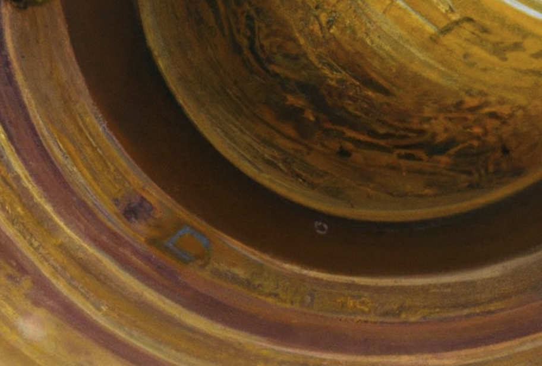

At Loreum DAO, we are driven by a singular purpose: to redefine the way smart contract governance is conducted. Just as early entrepreneurs in Amsterdam changed the course of modern history with Joint-Stock companies, we aim to disrupt the norms and usher in a new era of decentralized decision-making and human coordination. 

Our mission is to establish a standard, an unparalleled benchmark in smart contract governance. We believe that every line of code, every transaction, every decision made within the ecosystem of your online community should be governed with utmost efficiency, transparency, and fairness. 

We dare to challenge the status quo. We understand that innovation comes from questioning, experimenting, and pushing the boundaries within which nations rule. We will fearlessly embrace these principles, striving to create a governance framework that is not only robust but also adaptable to the ever-evolving needs of a global, digital workforce.

Loreum will empower individuals and organizations alike to participate actively in the decision-making processes that shape communities built with Chambers. By fostering an inclusive and collaborative environment, we aim to amplify the collective intelligence of our digital communities, transcending the limitations of any single entity, with composable DAO contracts.

Transparency is the cornerstone of our governance standard. We are committed to providing complete visibility into every aspect of decision-making, ensuring that all stakeholders have access to the information they need to make informed choices. Through radical transparency, we build trust and engender confidence in the integrity of our governance system.

We recognize that innovation is not a solitary endeavor. It requires the collective genius of diverse minds coming together to tackle complex challenges. In Loreum DAO, we embrace the power of collaboration, fostering a culture of open dialogue and knowledge sharing. We encourage our members to challenge each other, to learn from one another, and to co-create a governance standard that stands as a testament to our collective brilliance.

At the heart of our mission lies a deep commitment to the Ethereum community and the values it upholds. We will actively contribute to the growth and sustainability of the ecosystem, relentlessly pursuing the greater good. Through our governance standard, we will empower developers, users, and stakeholders to unlock the full potential of Ethereum, creating a future where decentralized decision-making becomes the norm.

Together, we will revolutionize smart contract governance, leaving an indelible mark on the Ethereum landscape. We invite you to join us in this journey of discovery, as we strive to build a better, more decentralized world. 

https://twitter.com/VitalikButerin/status/1608952184946987010