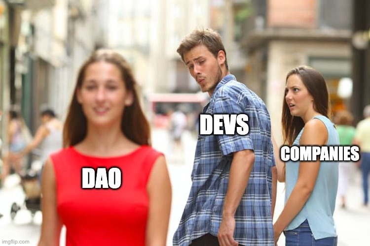

Decentralized Autonomous Organizations (DAOs) empower communities to make collective decisions without traditional hierarchical systems. DAOs leverage smart contract technology to enable transparent and decentralized governance, giving stakeholders the power to shape the direction of an organization. However, while DAOs offer numerous advantages, they also pose challenges that can impede effective decision-making. This article explores the difficulties of DAO governance and introduces the concept of Chambers as a solution to streamline decision-making processes.

<!-- truncate -->

<h3>The Challenges of DAO Governance</h3>

<h4>Scalability</h4>

As DAOs grow in size and complexity, decision-making can become cumbersome. With every stakeholder having a direct say, reaching consensus on critical issues can be time-consuming, hindering progress and efficiency. Coordinating and aligning diverse opinions becomes increasingly challenging as the DAO community expands.

<h4>Inclusivity vs. Expertise</h4>

DAOs strive to be inclusive, granting decision-making power to all participants. However, this egalitarian approach may overlook the importance of domain expertise and specialized knowledge. Some decisions necessitate input from individuals with specific skill sets or experience, which can be difficult to achieve in a purely decentralized model.

<h4>Coordination and Communication</h4>

Effective governance in a DAO relies on robust coordination and communication among stakeholders. DAOs often span multiple time zones and languages, making it challenging to ensure timely and clear interactions. Achieving consensus across a geographically dispersed community with diverse perspectives can be a formidable task.

<h3>The Benefits of Chambers</h3>

To address the challenges inherent in DAO governance, the concept of Chambers can provide a middle ground that combines the benefits of decentralization with the advantages of focused decision-making.

**Streamlined Decision-Making:** Chambers, also known as representative boards of directors, can expedite decision-making processes within a DAO. By delegating specific responsibilities to Chamber leaders, decision-making becomes more efficient and agile. Chambers can deliberate on complex issues, analyze available data, and make informed decisions, saving time and resources for the broader community.

**Expertise and Specialization:** Chamber leaders are elected based on their managerial aptitude in specific areas, rather than relying solely on wallet balances. This allows decision-makers with domain-specific knowledge, such as legal compliance, finance, marketing, or technical development, to contribute to the DAO. By enabling leadership seats with specialized expertise, the DAO can tap into a valuable resource pool while ensuring that decisions are made by qualified individuals.

**Coordinating Community Input:** Chamber leaders act as intermediaries between the community and the decision-making process. They are accountable to the DAO community, collecting and synthesizing feedback, concerns, and suggestions. Chamber leaders facilitate communication, ensuring that all stakeholders' voices are heard. They help distill diverse input into actionable decisions that represent the collective will of the community.

**Accountability and Transparency:** By implementing Chambers, DAO governance gains a clearer hierarchical structure. Chambers and their leaders take responsibility for their decisions and actions, fostering accountability and transparency. Regular updates to the community enhance trust and enable participants to feel a sense of ownership over the decision-making process.

While DAOs offer a promising vision of decentralized governance, they also present challenges that can hinder effective decision-making. Integrating representative Chambers into the governance structure can strike a balance between inclusivity and expertise, enabling streamlined decision-making processes and more efficient coordination. Chambers leverage domain-specific knowledge, facilitate community input, and enhance accountability. Although the concept of Chambers may not be widely recognized in the DAO ecosystem, exploring such models offers a potential solution to the complexities associated with DAO governance.

